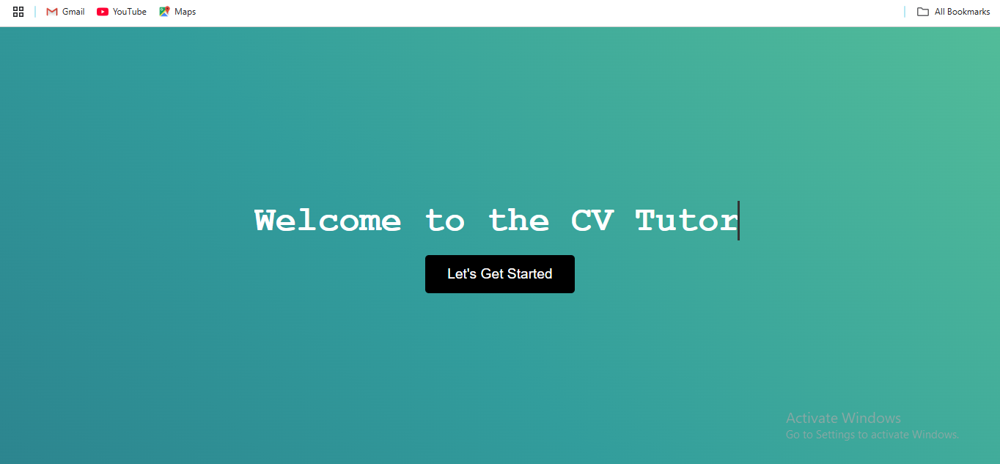
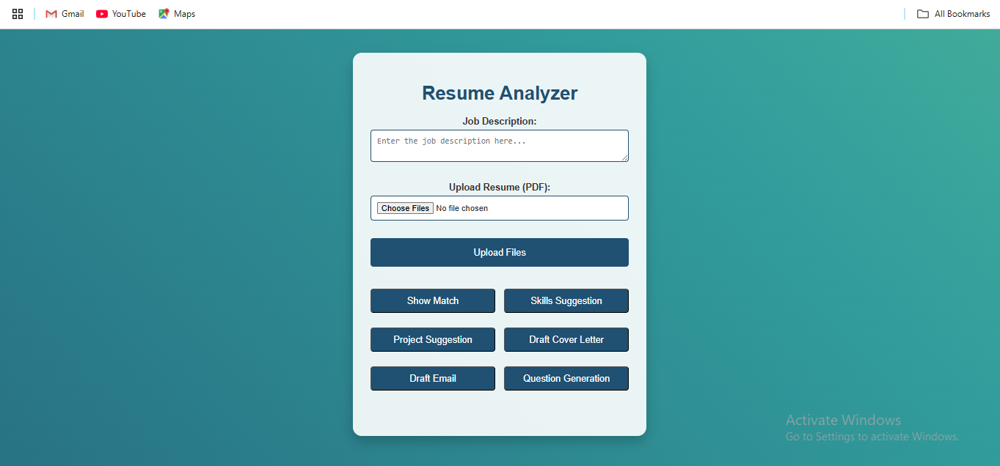
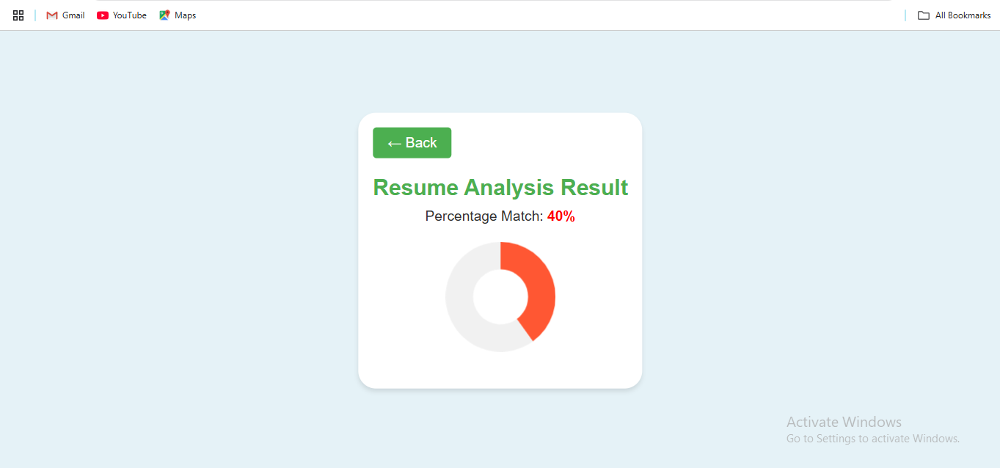
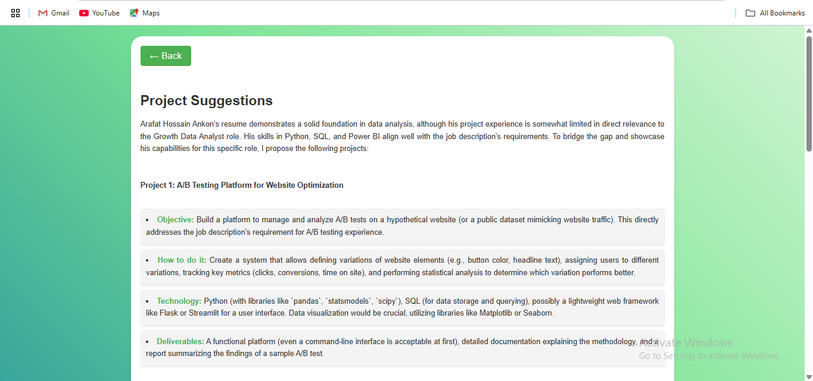
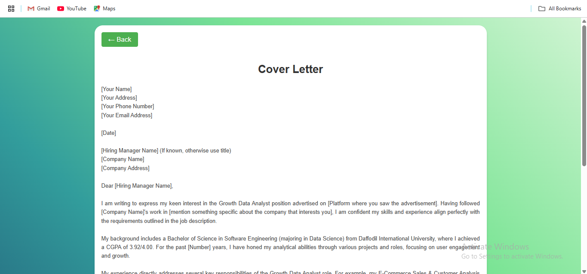
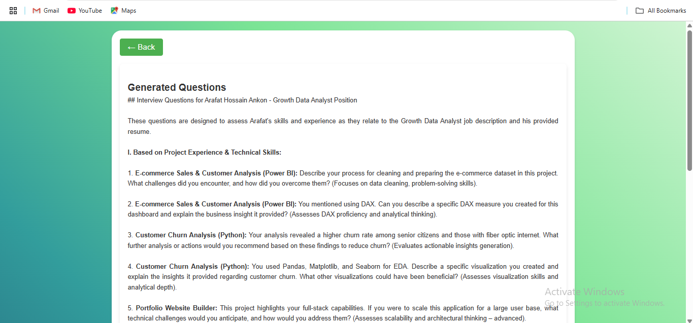

# CV-Tutor - Resume and Job Application Assistant

## Practical Demo : [Video](https://drive.google.com/file/d/11DN3kHQBzT9bVlBe5OEP7clwuDH97yeN/view?usp=drive_link)

**CV-Tutor** is an innovative web application designed to assist users in improving their resumes and cover letters by analyzing them against specific job descriptions. It provides tools for analyzing CVs, suggesting skills and projects, drafting cover letters, and generating interview questions, making it an essential tool for job seekers.

## Features

- **Resume Analysis**: Upload resumes in PDF format and analyze them against a given job description to receive a match percentage.
- **Skill Suggestions**: Based on the analysis, the tool will provide suggestions on key skills that may be missing in the CV.
- **Project Suggestions**: Receive tailored project suggestions that could enhance the CV for specific job roles.
- **Draft Cover Letter**: Automatically generate a customized cover letter based on the job description and user details.
- **Draft Email**: Create a professional email draft to accompany your resume or cover letter.
- **Question Generator**: Generate potential interview questions based on your resume and job description, helping you prepare better.

---

## Project Outputs

### Welcome Page

The initial page presents a welcoming message with a "Let's Get Started" button that directs the user to the resume analyzer.

### Resume Analyzer

This page allows users to input their job description and upload their resume for analysis. Multiple buttons provide options for generating suggestions and drafting documents based on the analysis.

### Resume Analysis Result

Once the user uploads their resume and job description, the tool returns a percentage match and visual representation of the resume’s alignment with the job description.

### Skill Suggestions

Users receive a detailed list of missing skills that they can add to their CV to make it more competitive for the job they’re targeting.

### Project Suggestions

The project suggestion section provides tailored project ideas that the user can undertake to showcase relevant experience to employers.

### Cover Letter

Based on the job description, CV-Tutor generates a professional cover letter draft that users can further customize.

### Draft Email

The tool also provides a draft email to accompany the CV and cover letter, allowing users to easily send their job applications.

### Question Generation

The question generation feature creates potential interview questions for the user to prepare for interviews based on their CV and job description.

---

### License
This project is licensed under the MIT License - see the LICENSE file for details.
